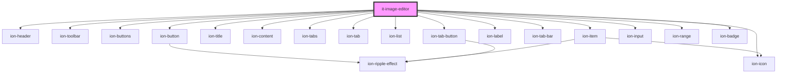

# it-image-editor

<!-- Auto Generated Below -->

## Properties

| Property | Attribute | Description | Type     | Default     |
| -------- | --------- | ----------- | -------- | ----------- |
| `src`    | `src`     |             | `string` | `undefined` |

## Events

| Event  | Description                              | Type                               |
| ------ | ---------------------------------------- | ---------------------------------- |
| `save` | Emitted when the save button is clicked. | `CustomEvent<{ base64: string; }>` |

## Dependencies

### Depends on

- ion-header
- ion-toolbar
- ion-buttons
- ion-button
- ion-icon
- ion-title
- ion-content
- ion-tabs
- ion-tab
- ion-list
- ion-item
- ion-label
- ion-tab-bar
- ion-tab-button
- ion-input
- ion-range
- ion-badge

### Graph

----------------------------------------------

*Built with [StencilJS](https://stenciljs.com/)*
